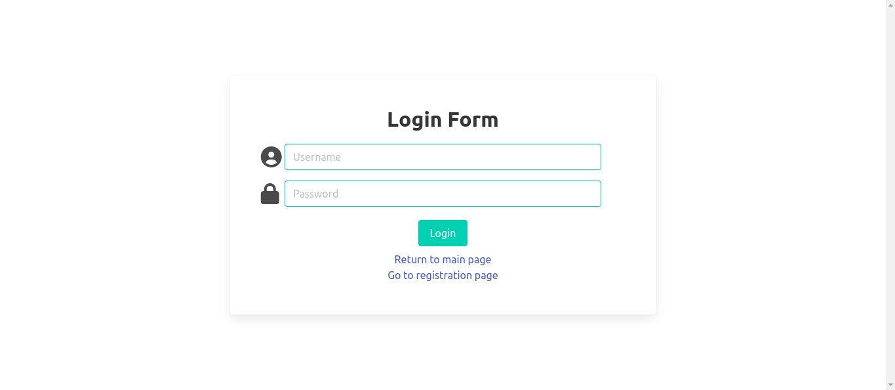

# Todo-list application with Flask/React 

A simple Todo app example. Application built using React for a front-end part with context-provider for centralization of application state and Flask as a back-end server

Try out [demo](http://35.240.80.71/).

Login credentials **login:admin password:123**

## Stack

- React
- React Router
- Flask
- Bulma

## Interface

Application consists of only 2 pages

### Main page

### Login page



Quick Start
-----------

```shell
$ git clone git@github.com:Tauassar/react_flask_todo_demo.git
$ cd react_flask_todo_demo
$ bash run.sh
```

These commands clone repository to your local PC and starts script developed to run development servers for both Flask and React

## Features

This vulnerable app includes the following capabilities to experiment with:
* Tasks can be sorted by username, email and status.
* Tasks listed with a pagination of 3 task per page.
* Any visitor can see the list of tasks and create new ones without authorization.
* Users with administrator privileges has the ability to edit the text of the task and finish them.
* Completed tasks in the general list are displayed with a corresponding mark.
